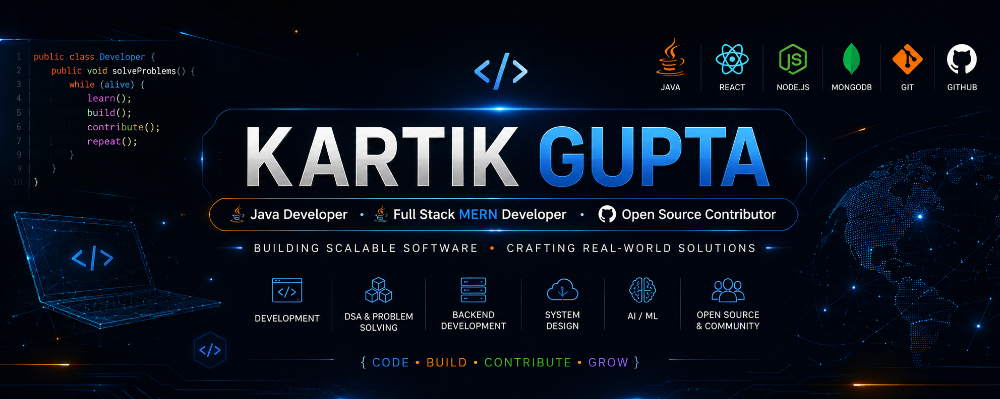

# Hey, I'm Kartik Gupta 👋
### Java Developer • Full Stack Developer • Open Source Contributor

---

# 🚀 About Me

- 🎓 B.Tech Computer Science Engineering (AI/ML) Student
- 💻 Passionate about Software Engineering & Full Stack Development
- ☕ Currently mastering Java & Data Structures & Algorithms
- 🌐 Building scalable web applications using the MERN Stack
- 🤖 Exploring Artificial Intelligence & Machine Learning
- 🚀 Active Open Source Contributor
- 📚 Always learning new technologies and building real-world projects
- ⚡ Goal: Become a Software Engineer who creates impactful and scalable products

---

# 🌐 Connect With Me

---

# 🧰 Tech Stack

### Languages

### Frontend

### Backend

### Tools

---

# 🎯 Current Focus

- ☕ Advanced Java
- 🧩 Data Structures & Algorithms
- 🌐 MERN Stack Development
- 🤖 Artificial Intelligence & Machine Learning
- 🚀 Open Source Contributions
- 💼 Building Portfolio Projects

---

# 💡 Featured Projects

- 🌿 **EventBuddy** — AI Event Organiser Platform
- 🤖 **EduVerse- Smart Learnign Platform** 
- 🌐 **Personal Portfolio**
- 💻 **Open Source Contributions**

---

# 📈 GitHub Analytics

  

  

  

---

# 🏆 Open Source

- 🌟 GirlScript Summer of Code Contributor
- 💙 Passionate about Community Collaboration
- 🚀 Learning through Real-World Contributions

---

# 🐍 Contribution Snake

<picture>
  <source
    media="(prefers-color-scheme: dark)"
    srcset="https://raw.githubusercontent.com/KartikeyG-world/KartikeyG-world/output/pacman-contribution-graph-dark.svg">

  <source
    media="(prefers-color-scheme: light)"
    srcset="https://raw.githubusercontent.com/KartikeyG-world/KartikeyG-world/output/pacman-contribution-graph.svg">

  
</picture>

---

### 💙 *"Learn. Build. Contribute. Repeat."*

